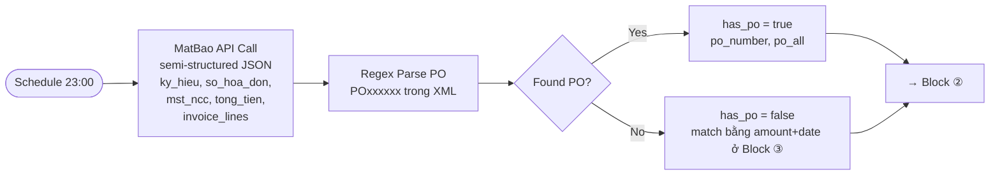
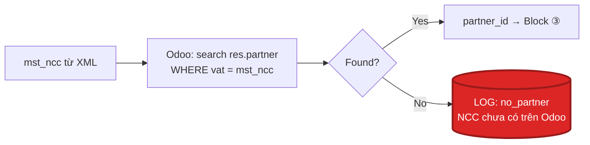
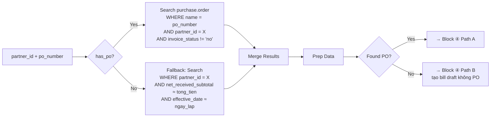
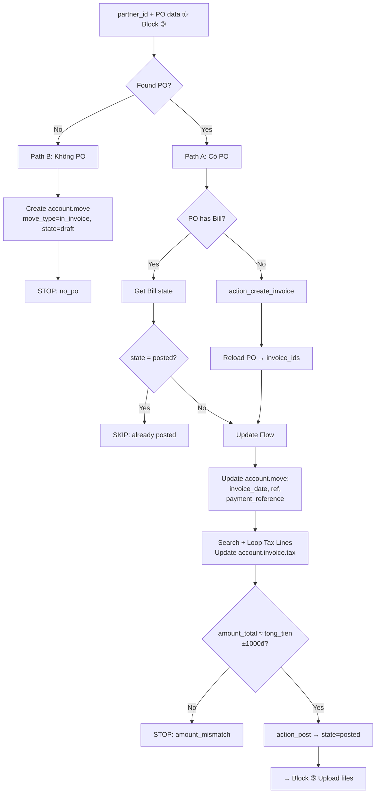
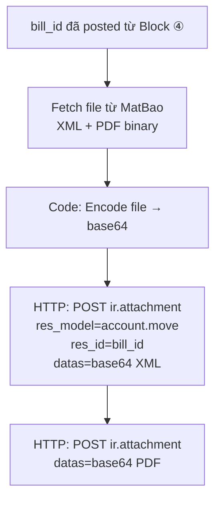
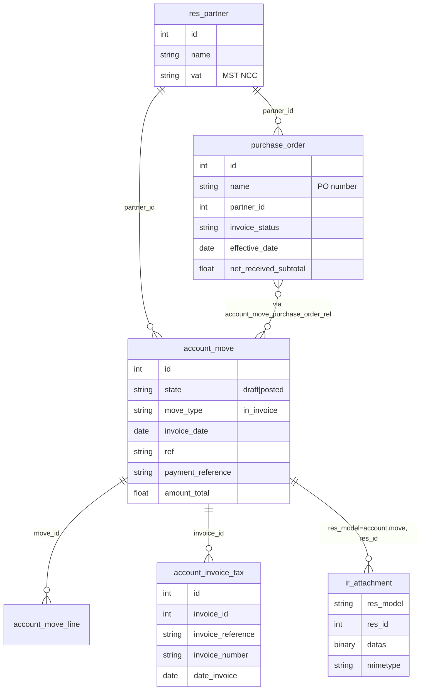

# Workflow Diagram: XML → Odoo Vendor Bill → Upload File

> Sơ đồ trực quan cho workflow [workflow-xml-to-odoo-vendor-bills.md](workflow-xml-to-odoo-vendor-bills.md)
> Workflow ID: `556wjyTaOwmybPul` — Version V8 (Apr 2026)

---

## Workflow chia thành 5 Block

| # | Block | Mục đích |
|---|-------|----------|
| 1 | **XML Extraction** | Gọi API MatBao → nhận dữ liệu semi-structured (JSON) của hoá đơn + extract PO number |
| 2 | **Check for Vendor** | Tìm NCC trên Odoo theo MST (`res.partner.vat`) |
| 3 | **Check for Purchase Order** | Tìm PO trên Odoo theo PO number hoặc fallback theo tiền + ngày |
| 4 | **Check for Invoices** | Tạo / update / confirm Vendor Bill (`account.move`) |
| 5 | **Upload PDF/XML to Invoices** | Attach file XML/PDF (tải từ MatBao) vào Bill qua `ir.attachment` |

---

## Full Pipeline (5 Blocks)

```mermaid
flowchart TD
    Start([Schedule Trigger 23:00 VN])

    subgraph B1["① XML EXTRACTION"]
        direction TB
        MatBao[MatBao API Call<br/>→ semi-structured JSON invoice data<br/>ky_hieu, so_hoa_don, mst_ncc,<br/>tong_tien, invoice_lines]
        RegexPO[Regex Parse PO Number<br/>POxxxxxx trong XML]
        HasPONum{Found PO?}
        WithPO[has_po = true<br/>po_number, po_all]
        NoPONum[has_po = false<br/>→ Block ③ fallback by amount+date]

        MatBao --> RegexPO --> HasPONum
        HasPONum -- Yes --> WithPO
        HasPONum -- No --> NoPONum
    end

    subgraph B2["② CHECK FOR VENDOR"]
        direction TB
        GetPartner[Odoo Get Partner<br/>search res.partner by vat = mst_ncc]
        HasPartner{Found Partner?}
        LogNoPartner[(LOG: no_partner<br/>NCC chưa có trên Odoo)]

        GetPartner --> HasPartner
        HasPartner -- No --> LogNoPartner
    end

    subgraph B3["③ CHECK FOR PURCHASE ORDER"]
        direction TB
        HasPO{has_po in XML?}
        SearchPONum[Odoo Search PO by name<br/>+ partner_id + invoice_status != no]
        SearchPOAmt[Odoo Search PO by<br/>partner_id + amount + date<br/>fallback]
        MergePO[Merge PO Results]
        Prep[Code: Prep Data<br/>normalize for next block]
        FoundPO{Found PO?}

        HasPO -- Yes --> SearchPONum
        HasPO -- No --> SearchPOAmt
        SearchPONum --> MergePO
        SearchPOAmt --> MergePO
        MergePO --> Prep --> FoundPO
    end

    subgraph B4["④ CHECK FOR INVOICES"]
        direction TB
        CreateNoPO[HTTP: Create Bill No PO<br/>account.move.create → draft]
        StopNoPO[STOP: no_po<br/>bill draft, xử lý thủ công]

        HasBill{PO already has Bill?}
        GetState[Odoo Get Bill State]
        IsPosted{state == posted?}
        SkipPosted[SKIP: already posted]

        CreateBill[HTTP: Create Vendor Bill<br/>purchase.order.action_create_invoice]
        ReloadPO[Odoo Reload PO<br/>get new invoice_ids]
        SetBillID[Set bill_id = invoice_ids 0]
        UpdateMove[Odoo Update account.move<br/>invoice_date, payment_reference, ref]
        SearchTax[Odoo Search Tax IDs<br/>account.invoice.tax WHERE invoice_id]
        LoopTax[Loop Over Tax IDs]
        UpdateTax[Odoo Update Tax Line<br/>invoice_reference, invoice_number, date_invoice]
        GetAmount[Odoo Get Bill Amount]
        AmountOK{amount_total ≈ tong_tien<br/>±1000đ?}
        StopMismatch[STOP: amount_mismatch]
        Confirm[HTTP: Confirm Bill<br/>account.move.action_post → posted]

        CreateNoPO --> StopNoPO
        HasBill -- Yes --> GetState --> IsPosted
        IsPosted -- Yes --> SkipPosted
        IsPosted -- No --> SetBillID
        HasBill -- No --> CreateBill --> ReloadPO --> SetBillID
        SetBillID --> UpdateMove --> SearchTax --> LoopTax
        LoopTax --> UpdateTax --> LoopTax
        LoopTax -- done --> GetAmount --> AmountOK
        AmountOK -- No --> StopMismatch
        AmountOK -- Yes --> Confirm
    end

    subgraph B5["⑤ UPLOAD PDF/XML TO INVOICES"]
        direction TB
        FetchFile[Fetch file từ MatBao<br/>XML + PDF binary]
        Encode[Code: Encode file → base64]
        AttachXML[HTTP: Attach XML<br/>ir.attachment res_model=account.move]
        AttachPDF[HTTP: Attach PDF<br/>ir.attachment res_model=account.move]

        FetchFile --> Encode --> AttachXML --> AttachPDF
    end

    Start --> B1
    WithPO --> GetPartner
    NoPONum --> GetPartner
    HasPartner -- Yes --> HasPO
    FoundPO -- No --> CreateNoPO
    FoundPO -- Yes --> HasBill
    Confirm --> FetchFile

    classDef b1 fill:#e3f2fd,stroke:#1976d2,stroke-width:2px
    classDef b2 fill:#fff3e0,stroke:#f57c00,stroke-width:2px
    classDef b3 fill:#fce4ec,stroke:#c2185b,stroke-width:2px
    classDef b4 fill:#e8f5e9,stroke:#388e3c,stroke-width:2px
    classDef b5 fill:#f3e5f5,stroke:#7b1fa2,stroke-width:2px
    classDef logError fill:#dc2626,stroke:#991b1b,stroke-width:3px,color:#fff

    class B1 b1
    class B2 b2
    class B3 b3
    class B4 b4
    class B5 b5
    class LogNoPartner logError
```

---

## Block ① XML Extraction

**Input:** MatBao API (thay thế cho việc đọc file XML từ SharePoint)
**Bước Regex:** quét text trong XML để tìm pattern `POxxxxxx` (PO + 6+ chữ số) vì PO number không phải field chuẩn trong hoá đơn điện tử VN — NCC thường ghi vào `ghi_chu` / `ten_hang` / `dien_giai`
**2 nhánh output:**
- `has_po = true` → Block ③ match PO theo `name`
- `has_po = false` → Block ③ fallback match theo `amount + date` (vẫn tiếp tục workflow, không STOP)

---

## Block ② Check for Vendor

**Model:** `res.partner` | **Field khoá:** `vat` (MST NCC)
**Không có partner:** ghi vào LOG để kế toán review + tạo Partner thủ công — workflow dừng xử lý invoice này

---

## Block ③ Check for Purchase Order

**Model:** `purchase.order` | **Field khoá:** `name`, `partner_id`, `invoice_status`

---

## Block ④ Check for Invoices

**Model:** `account.move` + `account.invoice.tax` | **Output:** `bill_id` đã `posted`

---

## Block ⑤ Upload PDF/XML to Invoices

**Model:** `ir.attachment` (polymorphic: `res_model=account.move`, `res_id=bill_id`)
**Không còn move file trên SharePoint** — dữ liệu gốc nằm trên MatBao, workflow chỉ cần tải về + attach vào Bill trên Odoo

---

## Odoo Models Relationship

