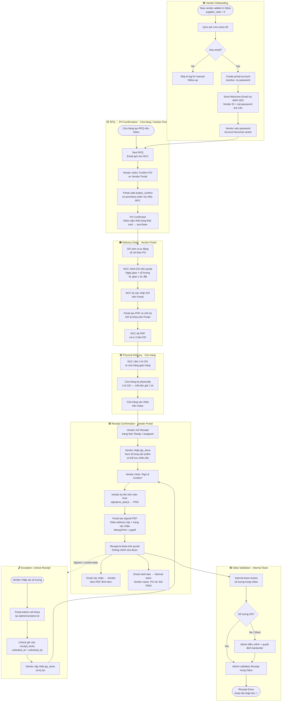
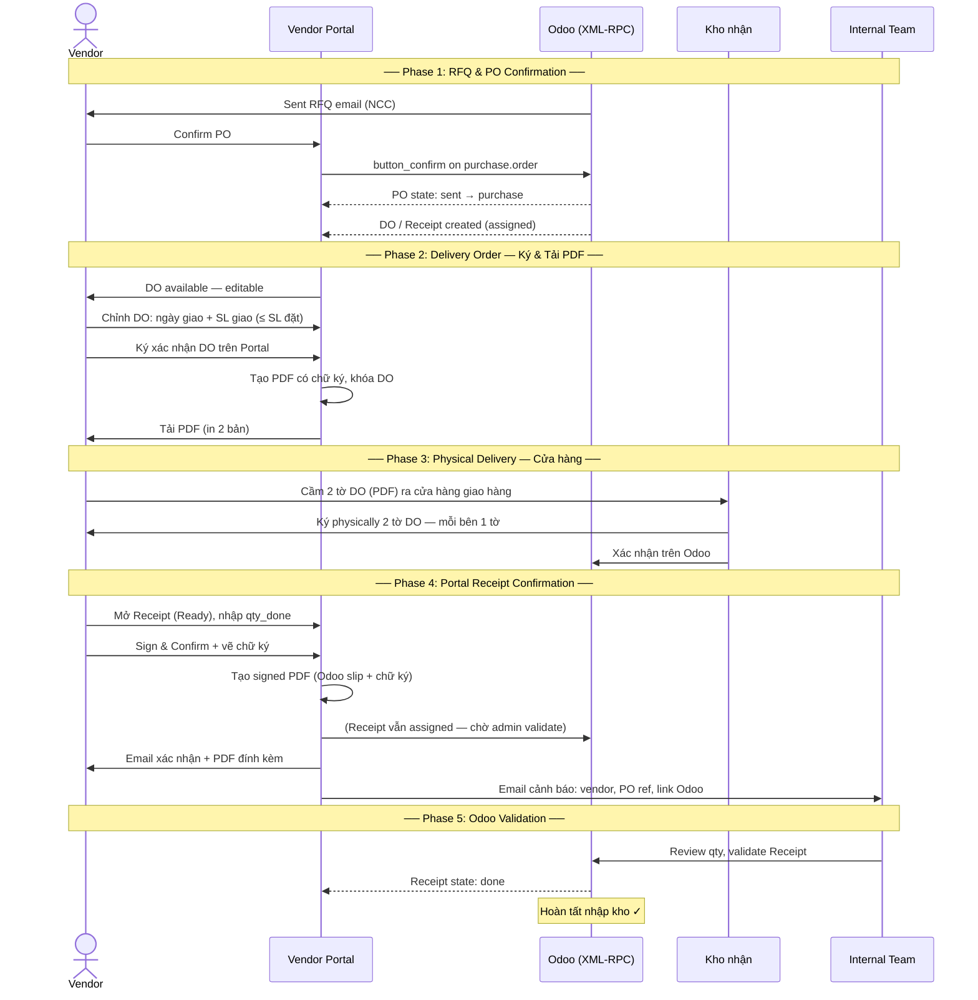
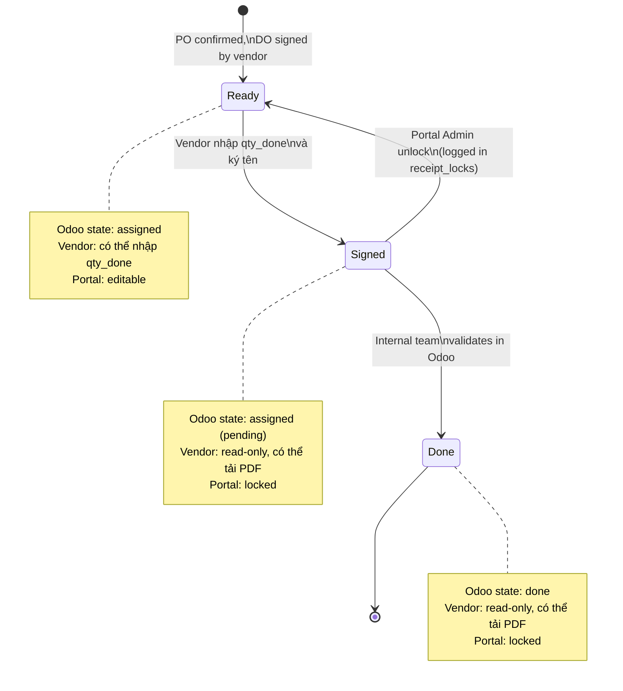

# 3SACH Vendor Portal — Process Flow

---

## Business Overview (Simple View)

```mermaid
flowchart LR
    classDef store    fill:#DBEAFE,stroke:#3B82F6,color:#1E3A5F,font-weight:bold
    classDef vendor   fill:#D1FAE5,stroke:#10B981,color:#064E3B,font-weight:bold
    classDef portal   fill:#EDE9FE,stroke:#7C3AED,color:#2E1065,font-weight:bold
    classDef internal fill:#FEF3C7,stroke:#F59E0B,color:#451A03,font-weight:bold
    classDef decision fill:#FFF,stroke:#6B7280,color:#111827

    S1([🏪 Cửa hàng\ntạo RFQ\ntrên Odoo]):::store
    S2([📧 Gửi RFQ\ncho nhà cung cấp]):::store

    V1([✅ Nhà cung cấp\nxác nhận PO\ntrên Portal]):::vendor
    V2([📦 Điền số lượng\nvà ngày giao\ntrên Portal]):::vendor
    V3([✍️ Ký xác nhận DO\ntrên Portal\nvà tải PDF]):::vendor
    V4([🚚 Cầm 2 tờ DO\nra cửa hàng]):::vendor

    P1{{Portal tạo\nPDF có chữ ký}}:::portal

    I1([🏪 Cửa hàng ký\nphysically 2 tờ DO\nmỗi bên giữ 1 tờ]):::store
    I2([✔️ Cửa hàng\nxác nhận\ntrên Odoo]):::store

    S1 --> S2 --> V1
    V1 --> V2
    V2 --> V3
    V3 --> P1
    P1 --> V4
    V4 --> I1
    I1 --> I2
    I2 --> DONE([🎉 Hoàn tất]):::store
```

> **Màu sắc:** 🔵 Cửa hàng &nbsp;|&nbsp; 🟢 Nhà cung cấp &nbsp;|&nbsp; 🟣 Hệ thống Portal &nbsp;|&nbsp; 🟡 Nội bộ 3Sach

---

## Full Purchase Workflow: RFQ → PO Confirm → Delivery → Receipt

---

## Swimlane View (4 Actors)

---

## Receipt State Machine

---

**Glossary**

| Term | Meaning |
|---|---|
| NCC | Nhà cung cấp (Vendor) |
| DO | Delivery Order |
| SL | Số lượng (Quantity) |
| RFQ | Request for Quotation |
| PO | Purchase Order |
| Receipt | Phiếu nhập kho Odoo |
