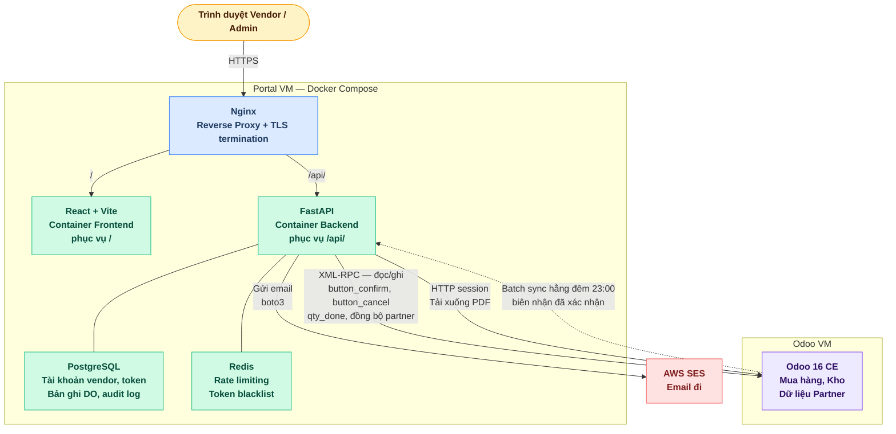
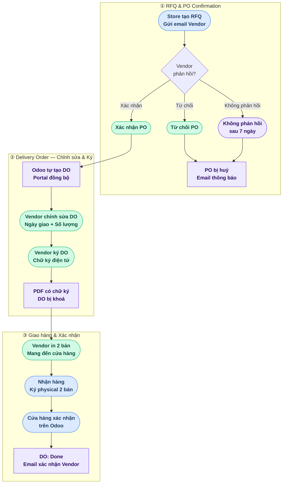

# Vendor Portal - Tài Liệu Đặc Tả
> Tài liệu Specs & Approach — không bao gồm code triển khai

| Tài liệu | Mục đích |
|---|---|
| **README.md** (file này) | Business logic, quy trình nghiệp vụ, và các quyết định thiết kế cấp cao |
| [PROCESS_FLOW.md](PROCESS_FLOW.md) | Sơ đồ luồng chi tiết: RFQ → PO → DO → Giao hàng → Xác nhận, kèm swimlane và state machine |
| [roadmap.md](roadmap.md) | Kế hoạch triển khai theo phase: DB schema, API endpoints, cấu hình hạ tầng, checklist go-live |

---

## Tổng Quan Dự Án

Một cổng thông tin web song ngữ (Tiếng Việt + Tiếng Anh) độc lập phục vụ hai loại người dùng: **nhà cung cấp (vendor)** và **quản trị viên portal (portal admin)**. Vendor đăng nhập bằng **Vendor ID** (`res.partner.id` từ Odoo), xác nhận hoặc từ chối các RFQ đã gửi, chỉnh sửa Delivery Order (số lượng và ngày giao hàng), ký điện tử và in DO, đồng thời theo dõi trạng thái giao hàng cho đến khi cửa hàng xác nhận biên nhận. Portal cũng hỗ trợ trả hàng thông qua Return Purchase Order (RPO) và Biên Bản Trả Hàng (Goods Return Note). Vendor có thể xuất dữ liệu dưới dạng PDF hoặc CSV phục vụ lập hóa đơn và đối soát. Portal admin dùng chung giao diện với vendor nhưng có thêm quyền xem toàn bộ vendor, toàn bộ PO và DO trong hệ thống, kích hoạt đồng bộ Odoo thủ công, mở khóa DO đã ký, và tải xuống PDF có chữ ký của bất kỳ vendor nào. Portal chạy trên một VM riêng biệt với Odoo và tích hợp qua Odoo XML-RPC API bằng một tài khoản dịch vụ chuyên dụng. **Vendor chỉ truy cập portal; cửa hàng chỉ truy cập Odoo.** Toàn bộ email được gửi qua AWS SES.

---

## Các Quyết Định Đã Xác Nhận

| Vấn đề | Quyết định |
|---|---|
| Phiên bản Odoo | 16 Community Edition |
| Giao thức Odoo API | XML-RPC (Python `xmlrpc.client`) |
| Định danh đăng nhập Vendor | `res.partner.id` (số nguyên, do Odoo cấp — không bao giờ thay đổi) |
| Mật khẩu Vendor | Thuộc portal, lưu trong portal PostgreSQL nội bộ |
| Nguồn dữ liệu hồ sơ | Đồng bộ một chiều từ Odoo `res.partner` cho các trường hồ sơ (tên, công ty, điện thoại, mã số thuế). Email được sao chép từ Odoo chỉ khi tạo tài khoản lần đầu (dùng để gửi email chào mừng), sau đó không bao giờ bị ghi đè bởi sync |
| Khởi tạo tài khoản | Tự động từ các partner Odoo có `is_vendor = True` **và** có `email` |
| Ngôn ngữ portal | Tiếng Việt + Tiếng Anh (song ngữ, người dùng tự chuyển đổi) |
| Trạng thái PO trên portal | Waiting (`sent`), Confirmed (`purchase`), Cancelled (`cancel`) — Draft (`draft`) không hiển thị. Tự động huỷ sau 7 ngày kể từ Expected Arrival nếu vendor chưa xác nhận hoặc từ chối |
| Trạng thái DO trên portal | Draft, Signed, Done, Cancelled |
| Trạng thái PO Odoo (không thay đổi) | RFQ / RFQ Sent / Purchase Order / Cancelled — portal không thay đổi hành vi gốc của Odoo |
| DO trên mỗi PO | Odoo tự động tạo đúng 1 DO (stock.picking) khi PO được xác nhận — portal đọc và hiển thị. Vendor không thể tạo thêm DO |
| Ngày giao hàng DO | Một ngày duy nhất cho toàn bộ DO (không theo từng dòng sản phẩm) |
| Chỉnh sửa DO | Vendor chỉnh sửa ngày giao hàng + số lượng (qty <= qty đặt hàng từ PO) |
| Điều kiện khoá DO | Chỉ khi vendor ký điện tử — không có cutoff lúc 23:00 |
| Ký DO | Chữ ký điện tử trên portal khoá DO, đẩy ngày giao hàng + số lượng đã nhập lên Odoo Receipt |
| In DO | Sau khi ký, vendor có thể in DO PDF (bao gồm chữ ký) nhiều lần |
| Ngôn ngữ DO PDF | Chỉ tiếng Việt — toàn bộ DO PDF in ra đều dùng nhãn tiếng Việt |
| Nội dung DO PDF | PDF tiếng Việt — barcode PO, thông tin vendor, mã cửa hàng, ngày xác nhận PO, ngày giao hàng, bảng sản phẩm (barcode, tên, UoM, số lượng giao, cột trống để cửa hàng điền) |
| Xử lý UoM | Một UoM duy nhất cho mỗi dòng sản phẩm, kế thừa từ PO (ví dụ: Thùng 12 Chai, Kg). Vendor chỉ điều chỉnh số lượng, không thay đổi UoM. Nếu UoM sai, PO phải được tạo lại |
| Xác nhận biên nhận | Cửa hàng xác nhận Receipt trong Odoo — đặt qty_done cuối cùng. Trạng thái DO chuyển sang Done, hiển thị số lượng thực tế đã nhận |
| Trả hàng | RPO (Return Purchase Order) + RN (Return Note / Biên Bản Trả Hàng). Vendor chỉ có thể đặt ngày lấy hàng và xác nhận — không thể thay đổi số lượng. Phải ký và in RN như DO |
| Tự động huỷ PO | Nếu vendor không xác nhận hoặc từ chối trong vòng 7 ngày kể từ Expected Arrival date, PO tự động bị huỷ |
| Vendor xác nhận PO | Vendor xác nhận Sent RFQ qua portal → trạng thái Odoo PO chuyển sang Confirmed, DO được tạo tự động (không gửi email) |
| Vendor từ chối RFQ | Vendor từ chối Sent RFQ qua portal → trạng thái Odoo PO chuyển sang Cancelled + email gửi PO creator |
| Khoá sau khi ký | DO bị khoá sau khi vendor ký — portal admin (buyer) có thể mở khóa trực tiếp trong portal (vendor được thông báo qua email, không cần lý do) |
| Lưu trữ dữ liệu | 24 tháng — PO cũ hơn 24 tháng bị xóa vĩnh viễn khỏi portal DB. Áp dụng cho mọi trạng thái |
| Xuất dữ liệu | Vendor có thể xuất dưới dạng PDF (riêng lẻ hoặc tổng hợp) hoặc CSV. Xuất đơn lẻ hoặc hàng loạt. Có bộ lọc theo khoảng ngày |
| Xử lý backorder | Vendor chỉ nộp qty — cửa hàng xác nhận và quyết định trong Odoo |
| Vai trò Admin | Tài khoản admin riêng biệt, mật khẩu do portal quản lý |
| Quyền Admin | Xem toàn bộ vendor, kích hoạt sync, xem toàn bộ PO/DO, mở khóa DO đã ký, tải xuống bất kỳ PDF nào |
| Giao diện Admin | Cùng bố cục với vendor portal, có thêm các mục menu dành cho admin |
| Tìm kiếm danh sách PO | Lọc theo số PO và khoảng ngày |
| Tóm tắt dashboard Vendor | Số lượng PO theo trạng thái (Waiting, Confirmed, Cancelled) hiển thị phía trên danh sách PO |
| Ghi chú của Vendor trên DO | Ghi chú tự do được thêm khi vendor ký DO |
| Lưu trữ PDF | 24 tháng — khớp với thời hạn lưu trữ dữ liệu PO |
| Thiết kế responsive | Hoạt động tốt trên cả desktop và mobile |
| Tài khoản Vendor | 1 Odoo partner = 1 tài khoản portal. Đăng nhập bằng Vendor ID (`res.partner.id`). Không hỗ trợ nhiều người dùng trên cùng một vendor |
| Thay đổi hồ sơ | Mọi thay đổi hồ sơ phải thực hiện qua Odoo — admin không thể chỉnh sửa trong portal |
| Ngôn ngữ Admin | Song ngữ (Tiếng Việt + Tiếng Anh) — giống vendor portal |
| Audit logging | Các hành động người dùng quan trọng được ghi lại: đăng nhập, xác nhận/từ chối PO, cập nhật/ký/mở khóa DO, xác nhận biên nhận |
| Thông báo email | Mời dùng, đặt lại mật khẩu, từ chối PO (gửi PO creator), xác nhận biên nhận (gửi vendor kèm cảnh báo nếu có sai lệch), DO được mở khóa (gửi vendor) |
| Người nhận email cửa hàng | Email gửi đến người đã tạo PO trong Odoo (không phải hộp thư chung) |
| Dịch vụ email | AWS SES |

---

## Tổng Quan Kiến Trúc

**Nguyên tắc chính:** Frontend React không bao giờ liên lạc trực tiếp với Odoo. Toàn bộ giao tiếp với Odoo được proxy qua backend FastAPI sử dụng một tài khoản dịch vụ duy nhất. Thông tin xác thực của vendor không bao giờ rời khỏi cơ sở dữ liệu nội bộ của portal.

---

> Chi tiết implementation flows (Auth, Sync, DO, Receipt) xem tại [Data Flow Summary](roadmap.md#data-flow-summary) trong roadmap.md.

---

## Nghiệp Vụ và Luồng Xử Lý

Phần này mô tả hành vi của portal theo ngôn ngữ nghiệp vụ, dành cho giao tiếp với các bên liên quan. Bao gồm bốn kịch bản chính: onboarding vendor mới, sử dụng portal hằng ngày, quy trình xác nhận giao hàng, và xử lý ngoại lệ.

---

### 1. Onboarding Vendor

**Điều kiện kích hoạt:** Một vendor mới được đăng ký trong Odoo với `is_vendor = True` **và** có địa chỉ email hợp lệ trên bản ghi partner.

**Những gì xảy ra tự động:**
1. Job đồng bộ portal chạy mỗi 6 giờ và phát hiện vendor mới trong Odoo
2. Một tài khoản portal được tạo, liên kết với Odoo ID của vendor
3. Vendor nhận được **Email Chào Mừng** (mặc định bằng tiếng Việt) bao gồm:
   - **Vendor ID** (`res.partner.id`) — số nguyên dùng để đăng nhập
   - Một **link đặt mật khẩu** có hiệu lực trong 24 giờ
4. Vendor nhấp vào link, đặt mật khẩu của mình, và tài khoản trở nên hoạt động
5. Từ thời điểm này, vendor có thể đăng nhập bất kỳ lúc nào bằng Vendor ID và mật khẩu

**Nếu vendor bỏ lỡ cửa sổ 24h:** họ dùng tùy chọn "Quên mật khẩu" trên trang đăng nhập, nhập Vendor ID và nhận được link đặt lại mới.

**Nếu vendor không có email trong Odoo:** job đồng bộ bỏ qua họ và ghi log trường hợp này. Đội nội bộ phải thêm email vào bản ghi partner Odoo — tài khoản sẽ được tạo vào chu kỳ đồng bộ tiếp theo.

**Cập nhật hồ sơ:** Nếu tên, số điện thoại, mã số thuế hoặc tên công ty của vendor thay đổi trong Odoo, portal phản ánh những thay đổi đó tự động vào lần đồng bộ tiếp theo. **Mật khẩu** của vendor chỉ được quản lý trên portal và không bao giờ bị ghi đè bởi sync. Vendor ID không bao giờ thay đổi — đây là `res.partner.id` cố định do Odoo cấp.

---

### 2. Xem Purchase Order

**Ai xem được gì:** Mỗi vendor chỉ thấy Purchase Order của chính mình. Về mặt kỹ thuật, vendor không thể xem dữ liệu của vendor khác.

**Những PO nào được hiển thị (trạng thái portal):**
- **Waiting** — RFQ đã được gửi cho vendor và đang chờ xác nhận. Vendor có thể xác nhận hoặc từ chối.
- **Confirmed** — PO đã được duyệt, DO đã được tạo. Vendor có thể chỉnh sửa và ký DO.
- **Cancelled** — PO đã bị hủy (vendor từ chối, hoặc cửa hàng hủy). Chỉ đọc.

RFQ ở trạng thái Draft không được hiển thị. Vendor có thể xem dữ liệu PO trong **24 tháng** kể từ ngày tạo. PO cũ hơn sẽ bị xóa vĩnh viễn.

**Xác nhận Sent RFQ:**
- Nút "Xác nhận PO" hiển thị trên trang chi tiết PO ở trạng thái Waiting
- Vendor nhấp "Xác nhận PO" → trạng thái Odoo PO chuyển sang Confirmed, Odoo tự động tạo DO liên kết (stock.picking), portal đọc và hiển thị
- Sau khi xác nhận, nút không còn hiển thị — PO chỉ đọc

**Từ chối Sent RFQ:**
- Nút "Từ chối" hiển thị cùng với "Xác nhận PO" trên trang chi tiết PO ở trạng thái Waiting
- Vendor nhấp "Từ chối" → trạng thái Odoo PO chuyển sang Cancelled
- Portal gửi email thông báo đến PO creator (nhân viên cửa hàng đã tạo RFQ)
- Từ chối là cuối cùng — cửa hàng phải tạo RFQ mới nếu muốn đặt hàng lại

**Tự động hủy:**
- Nếu vendor không xác nhận hoặc từ chối PO ở trạng thái Waiting trong vòng **7 ngày kể từ Expected Arrival date** (`date_planned` trên `purchase.order`), portal tự động hủy trong Odoo
- Một scheduled job kiểm tra hằng ngày các PO Waiting quá hạn
- Email thông báo gửi đến **cả vendor lẫn PO creator** khi PO bị tự động hủy

**Tìm kiếm và lọc:**
- Vendor có thể tìm kiếm theo số PO (ví dụ: gõ "PO004" để lọc danh sách tức thì)
- Vendor có thể lọc theo khoảng ngày (ví dụ: "PO từ tháng Một đến tháng Ba")
- Kết quả được phân trang — 20 PO mỗi trang

**Xem chi tiết PO:** nhấp vào PO hiển thị toàn bộ danh sách sản phẩm đặt hàng với số lượng và ngày giao hàng dự kiến, cùng với DO liên kết và trạng thái của nó (Draft / Signed / Done / Cancelled).

---

### 3. Delivery Order & Quy Trình Giao Hàng

Đây là quy trình nghiệp vụ cốt lõi của portal — từ RFQ đến giao hàng thực tế và xác nhận biên nhận.

> 🟢 Xanh lá = Vendor | 🔵 Xanh dương = Store | 🟣 Tím = Portal/System

#### 3.1 RFQ & PO Confirmation

- Store tạo RFQ trên Odoo — email tự động gửi cho Vendor
- Vendor đăng nhập Portal, xem RFQ và chọn **Xác nhận** hoặc **Từ chối**
- Nếu Vendor từ chối: PO bị huỷ trong Odoo, email thông báo gửi PO creator
- Nếu không phản hồi sau 7 ngày kể từ **Expected Arrival** (`date_planned`): hệ thống tự động huỷ PO, email gửi cả Vendor lẫn PO creator

#### 3.2 Delivery Order — Chỉnh sửa & Ký xác nhận

- Khi PO confirmed, **Odoo tự động tạo 1 DO** (stock.picking) — portal không tạo DO
- Portal đồng bộ và hiển thị DO ở trạng thái **Draft**
- Vendor chỉnh sửa: ngày giao hàng duy nhất + số lượng từng dòng (không vượt qty đặt hàng, đơn vị base UoM)
- Vendor có thể lưu nhiều lần trước khi ký
- Vendor ký điện tử (vẽ chữ ký) + ghi chú tuỳ chọn → DO bị **khoá**, không thể chỉnh sửa
- PDF có chữ ký được tạo tự động — không có email gửi đi khi ký

#### 3.3 Giao hàng thực tế

- Vendor in 2 bản PDF DO đã ký
- Vendor mang hàng + 2 bản DO đến cửa hàng
- Cả hai bên ký tay 2 bản paper — mỗi bên giữ 1 bản làm chứng từ

#### 3.4 Receipt Confirmation — Xác nhận nhận hàng

- Cửa hàng xác nhận nhận hàng trên Odoo (qty_done finalized)
- DO status chuyển sang **Done**, portal hiển thị qty thực tế nhận được
- Email tự động gửi Vendor xác nhận — nếu qty nhận khác với DO sẽ có cảnh báo chi tiết

> Sơ đồ toàn bộ flow (bao gồm Returns, Unlock DO) xem tại [PROCESS_FLOW.md](PROCESS_FLOW.md).

---

### 4. Vòng Đời Trạng Thái PO và DO

**Trạng thái PO (portal quản lý):**

| Trạng thái PO trên Portal | Trạng thái PO Odoo | Điều kiện kích hoạt | Vendor có thể làm |
|---|---|---|---|
| **Waiting** | `sent` | Cửa hàng gửi RFQ | Xác nhận hoặc Từ chối |
| **Confirmed** | `purchase` | Vendor xác nhận PO | Xem DO, xuất dữ liệu |
| **Cancelled** | `cancel` | Vendor từ chối hoặc cửa hàng hủy | Chỉ đọc |

**Trạng thái DO (portal quản lý):**

| Trạng thái DO | Điều kiện kích hoạt | Vendor có thể làm |
|---|---|---|
| **Draft** | PO confirmed, DO được tạo tự động | Chỉnh sửa ngày giao hàng + số lượng, lưu nhiều lần |
| **Signed** | Vendor ký DO điện tử | Chỉ đọc, in DO PDF (nhiều lần). Dữ liệu được đẩy lên Odoo Receipt |
| **Done** | Cửa hàng xác nhận Receipt trong Odoo | Chỉ đọc, xem số lượng thực tế nhận được bên cạnh số lượng giao, xuất PDF/CSV |
| **Cancelled** | PO bị hủy (trước khi xác nhận biên nhận) | Chỉ đọc |

**Quy tắc hủy:**
- Một PO chỉ có thể bị hủy nếu Receipt liên kết **chưa** được cửa hàng xác nhận (không có `qty_done`)
- Nếu Receipt đã được xác nhận trong Odoo, việc hủy bị chặn — portal hiển thị cảnh báo và vendor phải liên hệ bộ phận mua hàng để giải quyết

---

### 5. Khoá và Mở Khoá Sau Khi Ký

**Lý do DO bị khoá sau khi ký:** Sau khi vendor xác nhận số lượng giao hàng bằng chữ ký điện tử, DO trở thành chứng từ giao hàng chính thức. PDF đã ký là tài liệu vendor in ra và mang đến cửa hàng. Cho phép chỉnh sửa sau khi ký sẽ làm suy yếu tính toàn vẹn của chứng từ.

**Ý nghĩa thực tế của "bị khoá":**
- Tất cả các trường số lượng và ngày tháng trên DO đều chỉ đọc trong portal
- PDF DO đã ký vẫn có thể tải xuống và in bất kỳ lúc nào
- Vendor không thể ký lại hoặc nộp chữ ký mới
- Ngày giao hàng (`scheduled_date`) và số lượng (`quantity_done`) đã được đẩy lên Receipt của Odoo qua XML-RPC

**Quy trình mở khoá:**
Nếu số lượng nhập sai và vendor cần nộp lại, portal admin có thể mở khóa DO trực tiếp từ phần admin (`/admin/vendors/:id`). Việc mở khóa sẽ:
1. Gỡ bỏ khóa portal trên DO
2. Gửi email thông báo đến vendor
3. Vendor sau đó có thể cập nhật số lượng/ngày và ký lại
4. Hành động mở khóa được ghi vào audit log

---

### 6. Tóm Tắt Thông Báo Email

| Sự kiện | Người nhận | Ngôn ngữ | Nội dung |
|---|---|---|---|
| Tài khoản vendor mới được tạo | Vendor | Tiếng Việt (mặc định) | Vendor ID (số nguyên) + link đặt mật khẩu |
| Yêu cầu đặt lại mật khẩu | Vendor | Ngôn ngữ ưa thích của vendor | Link đặt lại (hết hạn sau 24h) |
| Vendor từ chối RFQ | PO creator (nhân viên cửa hàng) | Tiếng Việt | PO bị từ chối + hủy trong Odoo |
| PO tự động hủy (7 ngày) | Vendor + PO creator | Ngôn ngữ ưa thích của vendor / Tiếng Việt | PO tự động hủy do không phản hồi trong 7 ngày kể từ Expected Arrival |
| Cửa hàng xác nhận biên nhận | Vendor | Ngôn ngữ ưa thích của vendor | Thông báo xác nhận biên nhận. Cảnh báo nếu có sai lệch số lượng giữa DO và biên nhận |
| RPO được cửa hàng tạo | Vendor | Gửi bởi Odoo (Send by Email) | Thông báo đơn trả hàng — vendor nên đăng nhập portal để xác nhận |
| DO được admin mở khóa | Vendor | Ngôn ngữ ưa thích của vendor | Thông báo DO đã được mở khóa để chỉnh sửa lại |

**Lưu ý:** Không gửi email khi vendor xác nhận PO (xác nhận được đẩy lên Odoo theo thời gian thực) hoặc khi vendor ký DO/RN (dữ liệu được đẩy lên Odoo tự động). Người nhận email từ cửa hàng luôn là người cụ thể đã tạo PO trong Odoo, không phải hộp thư chung của cả nhóm. Email RPO được Odoo gửi nội bộ (không phải do portal gửi).

---

### 7. Những Gì Portal KHÔNG Làm

Điều quan trọng không kém là các bên liên quan cần hiểu rõ phạm vi của portal:

- **Không xác nhận biến động hàng tồn kho** — mọi xác nhận trong Odoo do cửa hàng thực hiện trong Odoo
- **Không tạo Purchase Order** — vendor có thể xác nhận hoặc từ chối Sent RFQ nhưng không thể tạo PO hoặc chỉnh sửa dòng PO
- **Không xử lý hóa đơn hay thanh toán** — nằm ngoài phạm vi của portal này (vendor có thể xuất dữ liệu cho mục đích lập hóa đơn của riêng mình)
- **Không quản lý backorder** — cửa hàng quyết định về backorder trong Odoo sau khi xem xét số lượng
- **Không thay đổi hành vi gốc của Odoo** — các trạng thái và quy trình của Odoo không bị thay đổi
- **Không để lộ thông tin xác thực Odoo cho vendor** — vendor không có quyền truy cập Odoo, dù trực tiếp hay gián tiếp
- **Không cho phép vendor xem dữ liệu của vendor khác** — được thực thi ở mọi tầng của hệ thống

---

> Chi tiết kỹ thuật về cơ chế sync Odoo ↔ Portal xem tại [Odoo ↔ Portal Sync](roadmap.md#odoo--portal-sync--open-questions--pending-it-confirmation) trong roadmap.md.

---

> Các phase triển khai, DB schema, API endpoints, và lưu ý cho developer xem tại [roadmap.md](roadmap.md).
