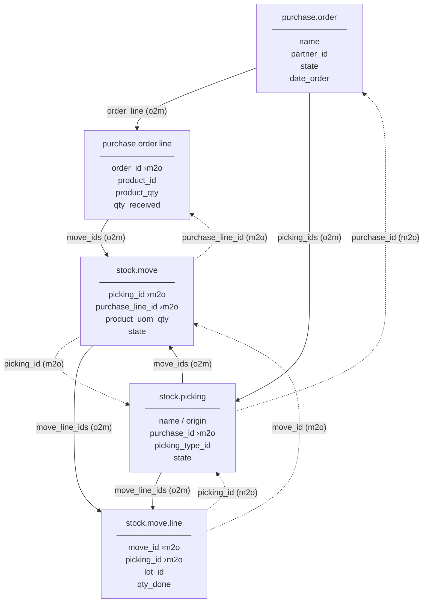

# Odoo 16 CE — Purchase & Stock Model Relationships

## Overview

These five models span two Odoo modules and together represent the full **purchase-to-receipt** flow: from a vendor order through warehouse operations down to individual lot/serial-tracked operations.

| Module | Models |
|---|---|
| `purchase` | `purchase.order`, `purchase.order.line` |
| `stock` | `stock.picking`, `stock.move`, `stock.move.line` |

---

## Model Summaries

### `purchase.order`
The commercial header for a vendor order. Holds partner, currency, delivery address, and totals. When confirmed, it triggers the creation of a `stock.picking` (receipt).

Key fields: `name`, `partner_id`, `state`, `date_order`, `order_line` (o2m), `picking_ids` (o2m)

---

### `purchase.order.line`
One line of a purchase order — one product, quantity, and price.

Key fields: `order_id` (m2o → `purchase.order`), `product_id`, `product_qty`, `price_unit`, `qty_received`, `qty_invoiced`, `move_ids` (o2m → `stock.move`)

---

### `stock.picking`
The **transfer header** — represents a receipt, delivery, or internal transfer. For a purchase, `picking_type_id.code = 'incoming'`.

Key fields: `name`, `origin`, `purchase_id` (m2o → `purchase.order`), `picking_type_id`, `partner_id`, `state`, `move_ids` (o2m), `move_line_ids` (o2m)

---

### `stock.move`
The **planned movement** of a product — one line per product on a picking. Bridges the commercial layer (`purchase.order.line`) to the logistic layer.

Key fields: `picking_id` (m2o → `stock.picking`), `purchase_line_id` (m2o → `purchase.order.line`), `product_id`, `product_uom_qty`, `location_id`, `location_dest_id`, `state`, `move_line_ids` (o2m)

---

### `stock.move.line`
The **actual operation detail** — tracks exact quantities done, lot/serial numbers, and packages. Created when stock is reserved or on validation.

Key fields: `move_id` (m2o → `stock.move`), `picking_id` (m2o → `stock.picking`), `product_id`, `lot_id`, `qty_done`, `reserved_qty`, `location_id`, `location_dest_id`

---

## Relationship Flow

> **Solid arrows** = one2many (parent creates/owns children)  
> **Dashed arrows** = many2one (back-reference / foreign key)

---

## Traversal Cheat Sheet

| Goal | ORM Path |
|---|---|
| Get all receipts for a PO | `po.picking_ids` |
| Get the PO from a receipt | `picking.purchase_id` |
| Get all moves for a PO line | `pol.move_ids` |
| Get the PO line from a move | `move.purchase_line_id` |
| Get detailed operations for a move | `move.move_line_ids` |
| Get the PO line from a move line | `ml.move_id.purchase_line_id` |
| Get all move lines for a picking | `picking.move_line_ids` |

---

## Flow Narrative

1. **PO Confirmation** — `purchase.order` changes state to `purchase`; `_create_picking()` fires and creates a `stock.picking` of type `incoming`. `purchase_id` on the picking points back to the PO.

2. **Move Generation** — For each `purchase.order.line`, a `stock.move` is created. `purchase_line_id` on the move links it back to the line. The move is attached to the picking via `picking_id`.

3. **Reservation** — When `action_assign()` runs on the picking, `stock.move.line` records are generated (one per lot/serial or per available quant). At this point, `reserved_qty` is populated.

4. **Validation** — When the warehouse operator clicks *Validate*, `qty_done` is written on each `stock.move.line`. Odoo updates `qty_received` on `purchase.order.line` by summing done quantities from the linked moves. Stock quants are updated.

5. **Backorder** — If not all quantities are received, a backorder `stock.picking` is created with the remaining `stock.move` quantities.

---

## Key Design Principle

| Model | Role |
|---|---|
| `stock.picking` | Transfer header (who, where, when) |
| `stock.move` | Line-level intent (what product, how many planned) |
| `stock.move.line` | Granular actuals (which lot, exact qty done) |
| `purchase.order.line` | Bridge between commercial and logistic layers via `purchase_line_id` |
